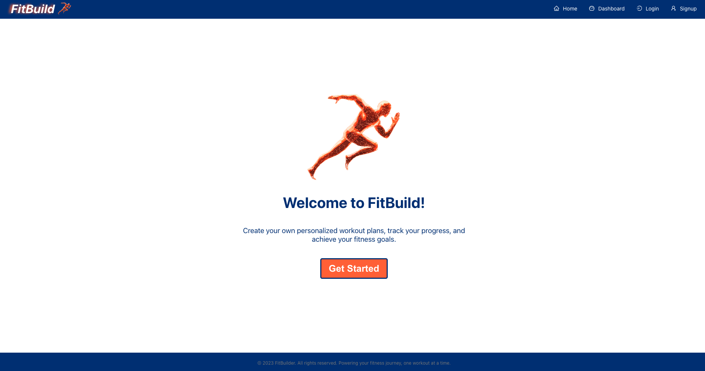

# FitBuild - Workout Planner

FitBuild application is a web application for creating and managing workout programs. It provides a user-friendly interface for users to design their own fitness programs, add exercises to workouts, and track their progress.

## Table of Contents
- [Screenshots](#screenshots)
- [Description](#description)
- [Installation](#installation)
- [Usage](#usage)
- [Contributing](#contributing)
- [Questions](#questions)
- [License](#license)

## Screenshots
![change later1](App Screenshots/Landing Page.png

## Description

FitBuild is built using React and Apollo Client. It uses GraphQL to interact with the server-side API. The application provides various pages and components for different functionalities, such as creating programs, adding exercises to workouts, viewing programs, starting and saving workouts, and more.

The code consists of multiple components and pages, including:

- Header: displays the navigation menu
- Footer: displayed at the bottom of the application
- FitBuildLanding Page: inital page of the application
- Dashboard: main dashboard page of the application
- ProgramPage: page component for displaying a specific program
- CreateProgram: form component for creating a new program
- WorkoutForm: form component for creating a new workout
- ExerciseComponent: for adding exercises to workouts
- ViewPrograms: page component for viewing all available programs
- StartWorkout: page component for starting a workout
- SaveWorkout: page component for finishing and saving a workout

The code also includes Apollo Client configuration for connecting to the GraphQL server. It sets up the necessary HTTP link and handles authentication using a token stored in local storage.

The deployed application can be visited [here](https://fit-build-03ae366fc163.herokuapp.com/).

## Installation

To install and run the FitBuild application locally, follow these steps:

1. Clone the repository: `git clone https://github.com/Pilotguide9897/FitBuilder`
2. Navigate to the project directory: `cd FitBuilder`
3. Install the dependencies: `npm install`
4. Start the application: `npm start`
5. Open your browser and visit http://localhost:3000 to access the FitBuild application.

## Usage
Once the FitBuild application is running, you can use the application to create and manage workout programs. Here are some usage instructions:

- Register or log in to your account
- Explore the dashboard to see an overview of your programs and workouts
- Navigate to the "View Programs" page to see all available programs
- Create a new program using the "Create Program" form
- Add exercises to your workouts using the "Add Exercises" page
- Start a workout by selecting a program and clicking the "Start Workout" button
- Complete your workout and save the results on the "Finish Workout" page

Feel free to explore the other pages and features of the application to get a better understanding of its functionality.

## Contributing
Contributions to the FitBuild application are welcome! If you find any bugs or want to suggest enhancements, please submit an issue on the GitHub repository. If you would like to contribute code, please follow these guidelines:

1. Fork the repository
2. Create a new branch for your feature or bug fix: `git checkout -b my-feature-branch`
3. Make your changes and commit them: `git commit -m "Add new feature"`
4. Push to the branch: `git push origin my-feature-branch`
5. Submit a pull request on the GitHub repository

## Questions

If you have any questions, please feel free to contact us:

- Jared GitHub: [Pilotguide9897](https://github.com/Pilotguide9897)
- Johnson GitHub: [StunnaDawg](https://github.com/StunnaDawg)
- Sarah GitHub: [mathminx](https://github.com/mathminx)
- Amanda GitHub: [Amanda-Lacroix](https://github.com/Amanda-Lacroix)

## License
This project is licensed under the . See the [license](https://opensource.org/licenses/MIT) documentation for more information.
